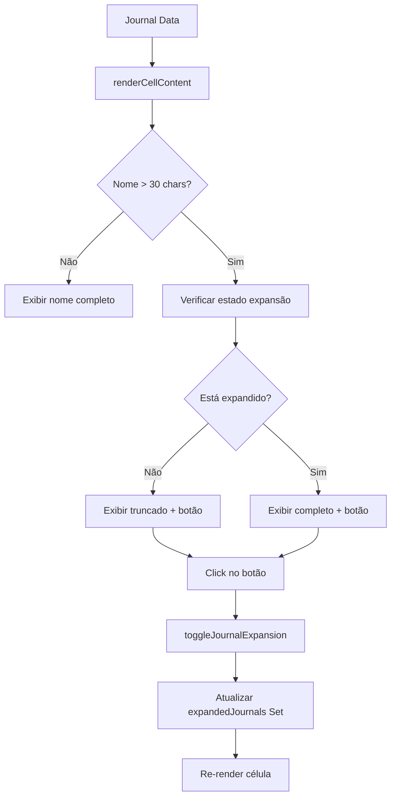

# Documento de Design - Limitação de Caracteres no Campo Journal

## Overview

Este documento detalha o design e implementação da funcionalidade de truncamento de nomes de journals na tabela de resultados do JournalScope. A solução implementa uma abordagem híbrida que combina CSS para truncamento visual e JavaScript para controle de estado de expansão, mantendo a performance e usabilidade da aplicação existente.

## Architecture

### Arquitetura de Componentes

```
┌─────────────────────────────────────────────────────────────┐
│                    ResultsTable Component                   │
├─────────────────────────────────────────────────────────────┤
│  ├── Estado de Expansão (expandedJournals: Set)            │
│  ├── Função de Truncamento (truncateJournalName)           │
│  ├── Função de Toggle (toggleJournalExpansion)             │
│  └── Renderização Condicional (renderCellContent)          │
├─────────────────────────────────────────────────────────────┤
│  CSS Classes                                               │
│  ├── .journal-cell (base styling)                         │
│  ├── .journal-cell-truncated (estado truncado)            │
│  ├── .journal-cell-expanded (estado expandido)            │
│  └── .journal-expand-button (botão de expansão)           │
├─────────────────────────────────────────────────────────────┤
│  Interações do Usuário                                    │
│  ├── Hover States (indicadores visuais)                   │
│  ├── Click Handlers (expansão/recolhimento)               │
│  └── Tooltip (nome completo)                              │
└─────────────────────────────────────────────────────────────┘
```

### Fluxo de Dados



## Components and Interfaces

### Enhanced Journal Cell Component

#### Estado de Expansão
```javascript
// Estado para controlar journals expandidos
const [expandedJournals, setExpandedJournals] = useState(new Set());

// Função para alternar expansão
const toggleJournalExpansion = (index) => {
  const newExpanded = new Set(expandedJournals);
  if (newExpanded.has(index)) {
    newExpanded.delete(index);
  } else {
    newExpanded.add(index);
  }
  setExpandedJournals(newExpanded);
};
```

#### Função de Truncamento
```javascript
// Função para truncar nome do journal
const truncateJournalName = (name, maxLength = 30) => {
  if (!name) return '';
  if (name.length <= maxLength) return name;
  return name.substring(0, maxLength) + '...';
};
```

#### Renderização da Célula Journal
```javascript
const renderJournalCell = (journal, index, searchTerm) => {
  const isExpanded = expandedJournals.has(index);
  const journalName = journal.journal || '';
  const shouldTruncate = journalName.length > 30;
  
  const displayName = isExpanded || !shouldTruncate 
    ? journalName 
    : truncateJournalName(journalName, 30);
  
  return (
    <div className="journal-cell-container">
      <div 
        className={`journal-cell ${isExpanded ? 'expanded' : 'truncated'}`}
        style={{ 
          maxWidth: isExpanded ? '400px' : '200px',
          cursor: shouldTruncate ? 'pointer' : 'default'
        }}
        title={shouldTruncate ? journalName : undefined}
      >
        <div className="flex items-center gap-2">
          <span className={isExpanded ? 'whitespace-normal break-words' : 'whitespace-nowrap'}>
            {highlightSearchTerm(displayName, searchTerm)}
          </span>
          
          {shouldTruncate && (
            <button
              onClick={(e) => {
                e.stopPropagation();
                toggleJournalExpansion(index);
              }}
              className="journal-expand-button"
              title={isExpanded ? 'Recolher nome' : 'Expandir nome completo'}
              aria-label={isExpanded ? 'Recolher nome do journal' : 'Expandir nome completo do journal'}
            >
              {isExpanded ? '−' : '+'}
            </button>
          )}
        </div>
      </div>
    </div>
  );
};
```

### CSS Design System

#### Classes Base
```css
.journal-cell-container {
  position: relative;
  min-width: 200px;
}

.journal-cell {
  font-weight: 500;
  color: #111827; /* text-gray-900 */
  transition: all 0.2s ease-in-out;
  overflow: hidden;
}

.journal-cell.truncated {
  text-overflow: ellipsis;
  white-space: nowrap;
  max-width: 200px;
}

.journal-cell.expanded {
  white-space: normal;
  word-break: break-word;
  max-width: 400px;
}

.journal-cell.truncated:hover {
  color: #2563eb; /* text-blue-600 */
  text-decoration: underline;
  cursor: pointer;
}
```

#### Botão de Expansão
```css
.journal-expand-button {
  background: #3b82f6; /* bg-blue-500 */
  color: white;
  border: none;
  border-radius: 50%;
  width: 20px;
  height: 20px;
  display: flex;
  align-items: center;
  justify-content: center;
  font-size: 12px;
  font-weight: bold;
  cursor: pointer;
  transition: all 0.2s ease-in-out;
  flex-shrink: 0;
}

.journal-expand-button:hover {
  background: #1d4ed8; /* bg-blue-700 */
  transform: scale(1.1);
}

.journal-expand-button:focus {
  outline: 2px solid #3b82f6;
  outline-offset: 2px;
}

.journal-expand-button:active {
  transform: scale(0.95);
}
```

#### Estados Responsivos
```css
/* Mobile adjustments */
@media (max-width: 768px) {
  .journal-cell.truncated {
    max-width: 150px;
  }
  
  .journal-cell.expanded {
    max-width: 300px;
  }
  
  .journal-expand-button {
    width: 18px;
    height: 18px;
    font-size: 10px;
  }
}

/* Tablet adjustments */
@media (min-width: 769px) and (max-width: 1024px) {
  .journal-cell.truncated {
    max-width: 180px;
  }
  
  .journal-cell.expanded {
    max-width: 350px;
  }
}
```

### Integração com Sistema Existente

#### Modificação do renderCellContent
```javascript
// Atualização da função existente para incluir truncamento
const renderCellContent = (journal, columnKey, column, searchTerm, index) => {
  const value = getNestedValue(journal, column.field);

  switch (columnKey) {
    case 'journal':
      return renderJournalCell(journal, index, searchTerm);
      
    // ... outros cases permanecem inalterados
    default:
      return (
        <span className="text-gray-600">
          {value || '-'}
        </span>
      );
  }
};
```

#### Reset de Estado em Filtros
```javascript
// Função para resetar expansões quando filtros mudam
useEffect(() => {
  setExpandedJournals(new Set());
}, [searchTerm, /* outros filtros */]);

// Reset em mudança de página
useEffect(() => {
  setExpandedJournals(new Set());
}, [currentPage]);
```

## Data Models

### Estado de Expansão
```typescript
interface ExpansionState {
  expandedJournals: Set<number>; // Índices dos journals expandidos
}

interface JournalCellProps {
  journal: Journal;
  index: number;
  searchTerm: string;
  isExpanded: boolean;
  onToggleExpansion: (index: number) => void;
}

interface TruncationConfig {
  maxLength: number;        // Padrão: 30
  ellipsis: string;        // Padrão: '...'
  expandedMaxWidth: string; // Padrão: '400px'
  truncatedMaxWidth: string; // Padrão: '200px'
}
```

### Configuração de Truncamento
```javascript
const TRUNCATION_CONFIG = {
  maxLength: 30,
  ellipsis: '...',
  expandedMaxWidth: '400px',
  truncatedMaxWidth: '200px',
  mobileMaxLength: 25,
  mobileExpandedMaxWidth: '300px',
  mobileTruncatedMaxWidth: '150px'
};
```

## Error Handling

### Tratamento de Erros de Renderização
```javascript
const renderJournalCellSafe = (journal, index, searchTerm) => {
  try {
    return renderJournalCell(journal, index, searchTerm);
  } catch (error) {
    console.error('Erro ao renderizar célula do journal:', error);
    
    // Fallback para renderização simples
    return (
      <div className="journal-cell">
        <span className="text-gray-900">
          {journal.journal || 'Nome não disponível'}
        </span>
      </div>
    );
  }
};
```

### Validação de Dados
```javascript
const validateJournalName = (name) => {
  if (typeof name !== 'string') {
    console.warn('Nome do journal deve ser string:', name);
    return String(name || '');
  }
  
  if (name.length > 500) {
    console.warn('Nome do journal muito longo:', name.length);
    return name.substring(0, 500);
  }
  
  return name;
};
```

## Testing Strategy

### Testes Unitários
```javascript
describe('Journal Name Truncation', () => {
  test('deve truncar nomes longos corretamente', () => {
    const longName = 'Este é um nome muito longo de journal que deve ser truncado';
    const result = truncateJournalName(longName, 30);
    expect(result).toBe('Este é um nome muito longo de...');
    expect(result.length).toBe(33); // 30 + 3 (...)
  });
  
  test('não deve truncar nomes curtos', () => {
    const shortName = 'Journal Curto';
    const result = truncateJournalName(shortName, 30);
    expect(result).toBe(shortName);
  });
  
  test('deve alternar expansão corretamente', () => {
    const { result } = renderHook(() => useState(new Set()));
    const [expandedJournals, setExpandedJournals] = result.current;
    
    // Simular toggle
    const newExpanded = new Set(expandedJournals);
    newExpanded.add(0);
    setExpandedJournals(newExpanded);
    
    expect(result.current[0].has(0)).toBe(true);
  });
});
```

### Testes de Integração
```javascript
describe('Journal Table Integration', () => {
  test('deve manter estado de expansão durante filtros', () => {
    const { getByTestId, getByText } = render(<ResultsTable data={mockData} />);
    
    // Expandir um journal
    fireEvent.click(getByText('+'));
    
    // Aplicar filtro
    fireEvent.change(getByTestId('search-input'), { target: { value: 'test' } });
    
    // Verificar se expansão foi resetada
    expect(getByText('+')).toBeInTheDocument();
  });
});
```

### Testes Visuais
```javascript
describe('Visual Regression Tests', () => {
  test('deve renderizar célula truncada corretamente', async () => {
    const component = render(<JournalCell journal={longNameJournal} />);
    expect(await component.takeScreenshot()).toMatchSnapshot();
  });
  
  test('deve renderizar célula expandida corretamente', async () => {
    const component = render(<JournalCell journal={longNameJournal} expanded />);
    expect(await component.takeScreenshot()).toMatchSnapshot();
  });
});
```

## Performance Optimizations

### Memoização de Componentes
```javascript
const JournalCell = React.memo(({ journal, index, searchTerm, isExpanded, onToggleExpansion }) => {
  const displayName = useMemo(() => {
    const journalName = journal.journal || '';
    const shouldTruncate = journalName.length > 30;
    
    return isExpanded || !shouldTruncate 
      ? journalName 
      : truncateJournalName(journalName, 30);
  }, [journal.journal, isExpanded]);
  
  return (
    <div className="journal-cell-container">
      {/* Renderização otimizada */}
    </div>
  );
});
```

### Otimização de Re-renders
```javascript
// Usar useCallback para funções de toggle
const toggleJournalExpansion = useCallback((index) => {
  setExpandedJournals(prev => {
    const newExpanded = new Set(prev);
    if (newExpanded.has(index)) {
      newExpanded.delete(index);
    } else {
      newExpanded.add(index);
    }
    return newExpanded;
  });
}, []);
```

### Lazy Loading de Estados
```javascript
// Carregar estado de expansão apenas quando necessário
const useJournalExpansion = () => {
  const [expandedJournals, setExpandedJournals] = useState(() => new Set());
  
  const toggleExpansion = useCallback((index) => {
    setExpandedJournals(prev => {
      const newSet = new Set(prev);
      newSet.has(index) ? newSet.delete(index) : newSet.add(index);
      return newSet;
    });
  }, []);
  
  return { expandedJournals, toggleExpansion };
};
```

## Accessibility Considerations

### ARIA Labels e Roles
```javascript
<button
  onClick={() => toggleJournalExpansion(index)}
  className="journal-expand-button"
  aria-label={isExpanded ? 'Recolher nome do journal' : 'Expandir nome completo do journal'}
  aria-expanded={isExpanded}
  role="button"
  tabIndex={0}
>
  {isExpanded ? '−' : '+'}
</button>
```

### Navegação por Teclado
```javascript
const handleKeyDown = (event, index) => {
  if (event.key === 'Enter' || event.key === ' ') {
    event.preventDefault();
    toggleJournalExpansion(index);
  }
};
```

### Screen Reader Support
```javascript
<div 
  className="journal-cell"
  aria-label={`Nome do journal: ${journalName}${shouldTruncate ? ' (clique para expandir)' : ''}`}
  role="cell"
>
  {/* Conteúdo da célula */}
</div>
```

## Security Considerations

### Sanitização de Nomes
```javascript
const sanitizeJournalName = (name) => {
  // Remover caracteres potencialmente perigosos
  return name
    .replace(/<script\b[^<]*(?:(?!<\/script>)<[^<]*)*<\/script>/gi, '')
    .replace(/javascript:/gi, '')
    .replace(/on\w+\s*=/gi, '');
};
```

### Validação de Entrada
```javascript
const validateTruncationLength = (length) => {
  const minLength = 10;
  const maxLength = 100;
  
  if (length < minLength || length > maxLength) {
    console.warn(`Comprimento de truncamento inválido: ${length}`);
    return 30; // valor padrão
  }
  
  return length;
};
```

Este design fornece uma base sólida para implementar a funcionalidade de truncamento de nomes de journals, mantendo a performance, usabilidade e acessibilidade da aplicação existente.